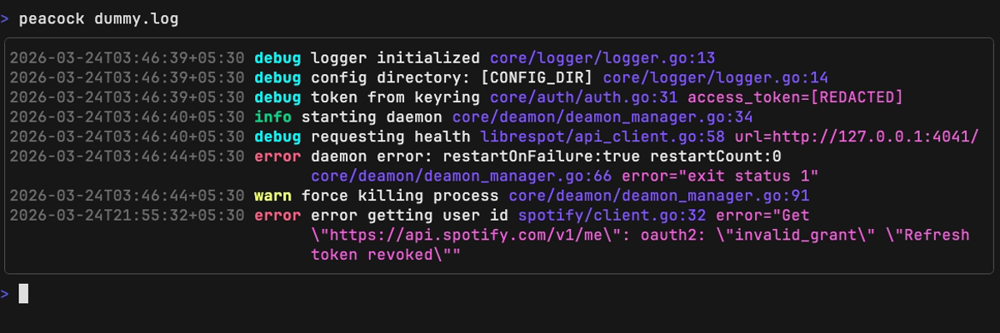
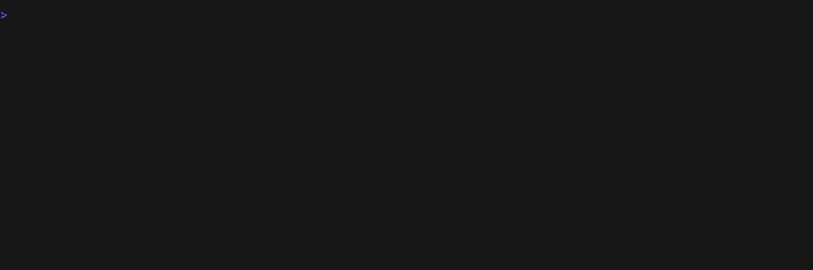

<div align="center">
  <h1>Peacock</h1>
</div>

<p align="center">
  
</p>

<div align="center">
  A charming <code>tail</code> replacement for developers
</div>

<p align="center">
  <a href="https://go.dev/"></a>
  <a href="https://github.com/dubeyKartikay/peacock/releases"></a>
  <a href="./LICENSE"></a>
  <a href="https://goreportcard.com/report/github.com/dubeyKartikay/peacock"></a>
</p>

Pipe your JSON log output into peacock and get colorized, readable, filterable log streams in the terminal.



```sh
go run . | peacock
kubectl logs -f my-pod | peacock
peacock -f app.log
```

#### Tail Vs Peacock



#### Follow Logs in Peacock


#### Pause / Resume Live Tail


---

## Installation

**One-liner** (Linux & macOS) — installs the latest release to `~/.local/bin` and updates your shell config:

```sh
curl -fsSL https://raw.githubusercontent.com/dubeyKartikay/peacock/main/install.sh | bash
```

**With Go:**

```sh
go install github.com/dubeyKartikay/peacock/cmd/peacock@latest
```

**Manual** — pre-built binaries for Linux, macOS, and Windows are available on the [releases page](https://github.com/dubeyKartikay/peacock/releases).

```sh
# Extract the archive (replace filename with your platform's download)
tar -xzf peacock_Linux_x86_64.tar.gz

# Check where your PATH installs binaries
echo $PATH

# Copy the binary to a directory on your PATH (e.g. /usr/local/bin)
sudo cp peacock /usr/local/bin/

# Verify the install
peacock --help
```

---

## Usage

```sh
# Read a file
peacock app.log

# Tail a file (follow mode)
peacock -f app.log

# Tail the last 50 lines of a file
peacock -f -n 50 app.log

# Pipe stdin
your-app | peacock
```

### CLI Flags

| Flag | Default | Description |
|------|---------|-------------|
| `-f`, `--follow` | `false` | Follow appended lines (like `tail -f`) |
| `-n`, `--lines` | `10` | Number of lines to read from end of file on startup |
| `--config` | Platform default | Path to a custom config file |

### Keybindings

| Key | Action |
|-----|--------|
| `Space` | Pause / resume live tail |
| `/` | Enter filter mode |
| `Esc` | Clear filter and exit filter mode |
| `g` | Jump to top |
| `G` | Jump to bottom |
| `PageUp` / `Ctrl+B` | Scroll up one page |
| `PageDown` / `Ctrl+F` | Scroll down one page |
| `Ctrl+C` | Quit |

---

## JSON Log Highlighting

peacock parses each line as JSON and renders it with structured formatting and color:

- **Level**: color-coded: `ERROR`/`FATAL` in red, `WARN` in yellow, `INFO` in green, `DEBUG` in cyan
- **Timestamp**: dimmed, pulled from `time` or `timestamp` fields
- **Message**: bright white, pulled from `msg` or `message` fields
- **Caller**: pulled from `caller` or `file` fields
- **Context**: all remaining fields rendered as dimmed `key=value` pairs

Non-JSON lines are printed as-is without any transformation.

---

## Configuration

The config file location depends on your platform:

| Platform | Path |
|----------|------|
| Linux | `$XDG_CONFIG_HOME/peacock/config.yaml` (falls back to `~/.config/peacock/config.yaml`) |
| macOS | `~/Library/Application Support/peacock/config.yaml` |
| Windows | `%AppData%\peacock\config.yaml` |

The directory and file are created automatically on first run if they don't exist.

### Full Config Reference

```yaml
buffer:
  max_entries: 5000              # Max log entries to keep in memory

input:
  filter_prompt: "/ "            # Prompt shown in filter mode
  filter_placeholder: "filter logs"
  filter_char_limit: 256
  scanner_initial_buffer_bytes: 65536   # 64KB
  scanner_max_buffer_bytes: 1048576     # 1MB

source:
  file_tail_lines: 10            # Lines to read from end of file (-n default)
  file_poll: true                # Use polling instead of inotify
  file_reopen: false             # Reopen file if rotated/replaced

theme:
  level_error: "9"               # Color for ERROR/FATAL (256-color ANSI)
  level_warn: "11"               # Color for WARN
  level_info: "10"               # Color for INFO
  level_debug: "14"              # Color for DEBUG
  level_other: "7"               # Color for unrecognized levels
  level_bold: true
  timestamp_fg: "7"
  timestamp_faint: true
  message_fg: "15"
  caller_fg: "4"
  context_fg: "5"
  raw_fg: "7"
  panel_border: "8"
  status_fg: "7"
  filter_fg: "15"
  filter_bg: "8"
```

Theme colors accept either a [256-color ANSI code](https://en.wikipedia.org/wiki/ANSI_escape_code#8-bit) (e.g. `"9"`) or a hex color string (e.g. `"#ff5f5f"`).

### Priority

Config values are resolved in this order (highest to lowest):

1. **Environment variables**: overrides everything
2. **`config.yaml`**: your config file
3. **Defaults**: built-in fallback values

### Environment Variables

Any config key can be set via an environment variable using the `PEACOCK_` prefix. Nested keys are joined with `_`:

```sh
PEACOCK_BUFFER_MAX_ENTRIES=10000       # buffer.max_entries
PEACOCK_THEME_LEVEL_ERROR="#ff0000"    # theme.level_error
PEACOCK_SOURCE_FILE_POLL=false         # source.file_poll
```

---

## Future Scope

The following items are planned but not yet implemented.


- **Logfmt support**: v0 only parses JSON; logfmt auto-detection is deferred
- **Multi-file multiplexing**: tail multiple files simultaneously with per-source tagging
- **Complex log rotation handling**: re-attaching to rotated/moved files without restarting
- **In-message syntax highlighting**: highlight IPs, UUIDs, durations, and other patterns inside log messages
- **Stack trace parsing**: multi-line stack traces currently print as raw strings
- **Custom JSON key mapping**: CLI flags or config to define which keys map to level/message/timestamp/caller
